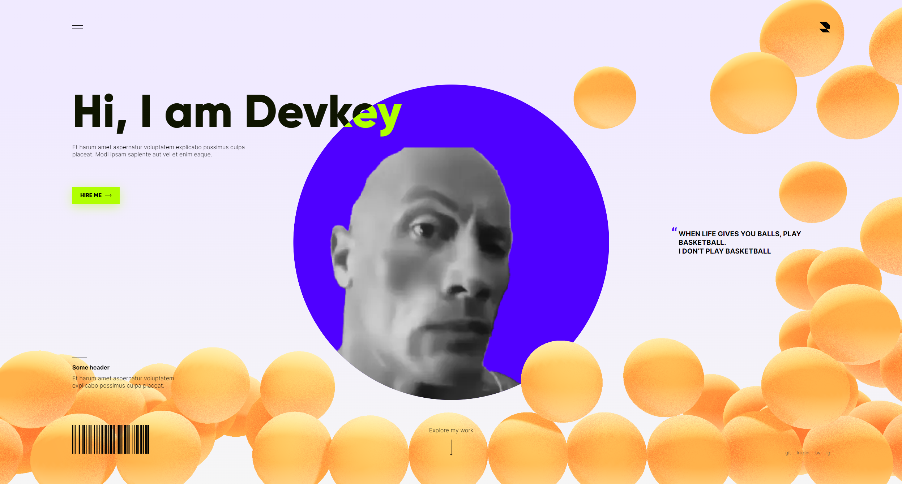

# React-three portfolio
This is an example portfolio landing page made using `react-three`.

## Clone
    git clone git@github.com:Devkeystuff/react-three-portfolio.git

## How to run

1. Run `yarn` to install dependencies
2. Run `yarn dev` to run locally

### [Website](portfolio-devkey.vercel.app)
